### Re-Image MTR Unit

#
***_Requirement_***
  - USB Keyboard
  - USB 32GB DRIVE
  - Click here to download the INTEL NUC M203 Recovery Image (13GB+)
#
***_A USB stick formatted as FAT32_***
  - The USB stick should be large enough to contain the (unzipped) restoration media.
  - It is strongly recommended that you use the fastest USB media available to you, to minimize the time the re-imaging process takes.

#
***Step 1.***
- Download the new INTEL NUC M203 Recovery Image (13GB+)
- Once the Image file is download process to the next step.

***Preparing USB Drive.***
- (1).	Plug the USB stick you wish to use into your desktop/laptop computer.
- (2).	Right-click the USB stick, and select “Format…”
- (3).	Use the “File system” drop-down to select “FAT32”
- (4).	Click “Start”
- (5).	Extract your manufacturer’s recovery ZIP file to the root of your USB stick
    - a.	If the files are unzipped into a single sub-folder and into the root of the USB drive.
- (6).	Eject your USB stick from your desktop/laptop computer.
- (7).	If your MTR system is not already power off, power it off now by pressing and holding the power button.
- (8).	Remove all peripheral from your MTR system except the keyboard and mouse.
- (9).	Plug your USB stick directly into the USB port on the system.
- (10).	Before we boot and install new image to the MTR system, first we need to adjust the BIOS setting.
  - a.	Entering NUC BIOS
       - i.	Power on the NUC PC system, then immediately Press F2 to enter BIOS
          1.	In the main screen press Advanced
          2.	Now select Devices, Onboard Devices 
          3.	In Legacy Device configuration match what you see in the screen shot below to the NUC system you currently working on.

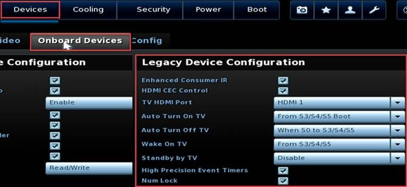

***Now go to Power do the same match what you see below don’t forget scroll down more options in bottom of secondary power setting that need to be enable/disable..***
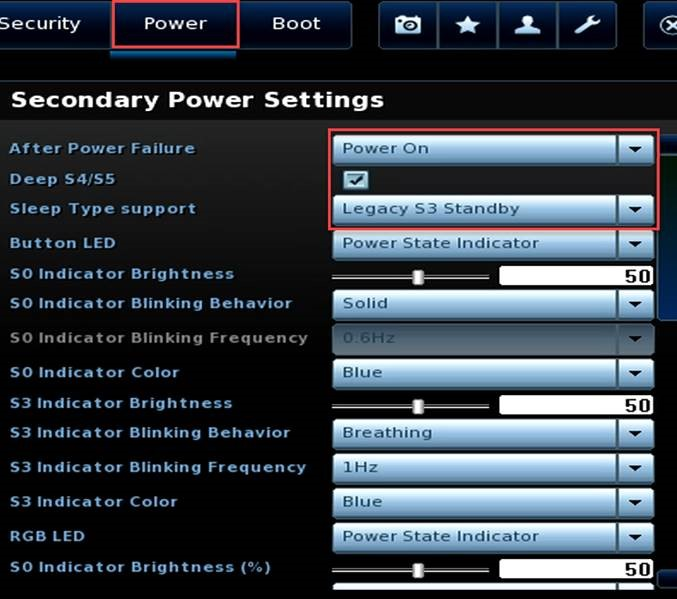
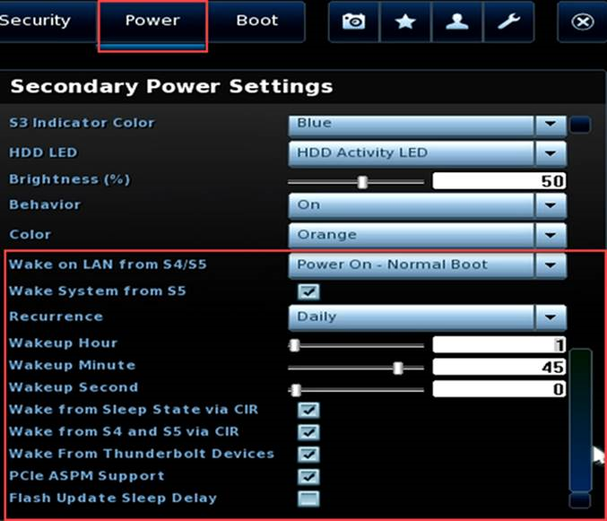
***Exit the NUC PC BIOS but don’t forget to save all the changes you made, the system will not reboot.***

- (11). Now we will be Booting to the USB stick. Start pressing F10 to enter the boot menu. Select the UEFI USB option and continue.
- (12).	Wait. The imaging process can take a very long time, depending on how fast your USB media is.
- (13).	Once the restoration process has completed, the system will reboot automatically, and proceed through device installation.
- (14).	After device installation is complete, Windows OOBE will start, just start clicking next to complete and then it will reboot again.
- (15).	After the final reboot, the next screen will be the MTR apps setup wizard, just simply fill up the field with the correct account info.

### ***__Step 1: Setup Wizard  for MTR App__***
#
**Clicking the agree, NEXT**
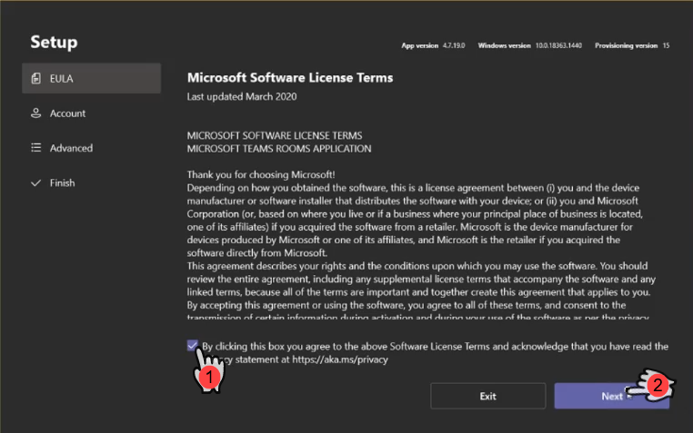

***Account (for testing purpose let’s use test@domain.com)***
***Email: test@domain.com***
***Password: test@domain.com***
***Supported meeting mode: Microsoft Teams (Default)***
***Check Modern Authentication***
### NEXT

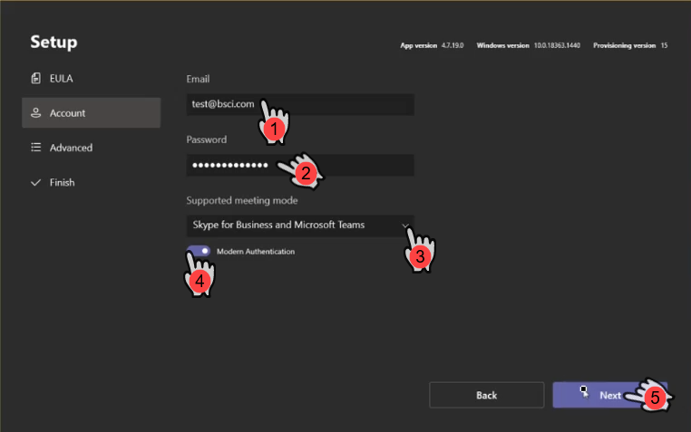

***_In Advanced, just simple click NEXT_***
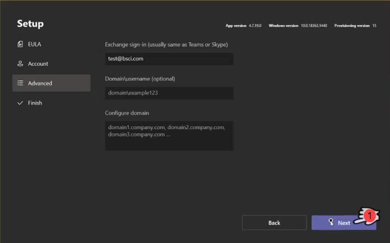

***_Now, click Finish_***
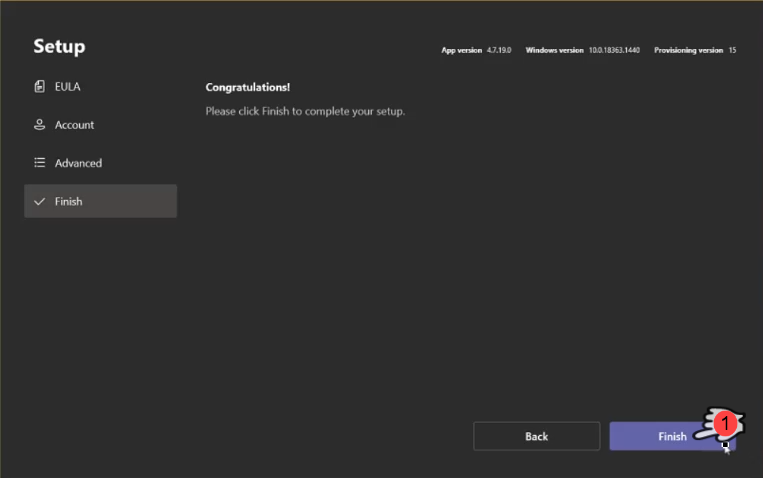

***_The MTR Unit should reboot._***

### ***__Step 2: Enabling Remote Desktop to the NUC PC__***
#
***Now from MTR App, click …MORE, Click Settings***
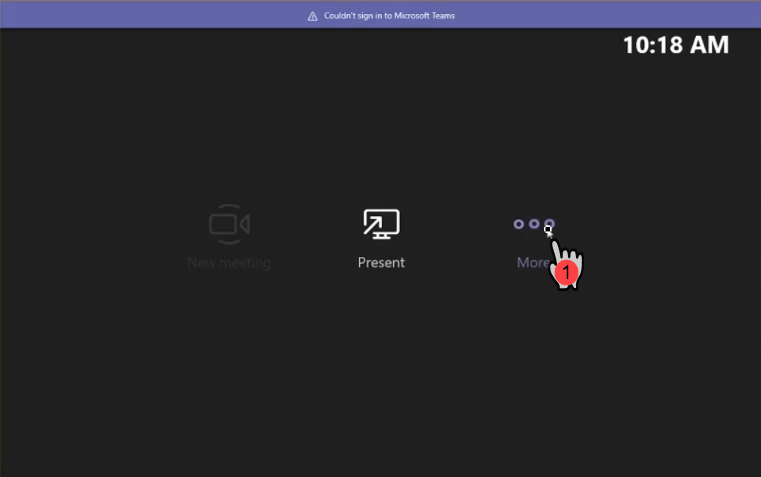
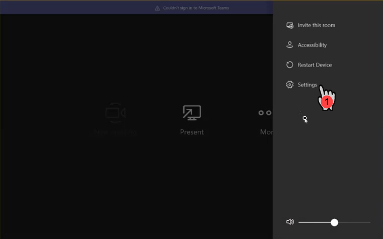

***This will pop-up windows requesting for Admin password, type in sfb then enter.***
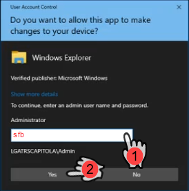

***In Setting Windows***
***Click Windows Settings***
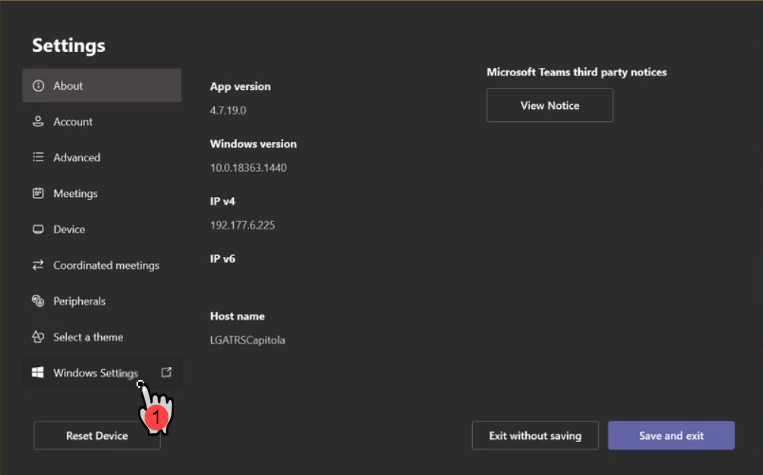

***Now Select Administrator for the profile.***
***Type in sfb for password then enter.***
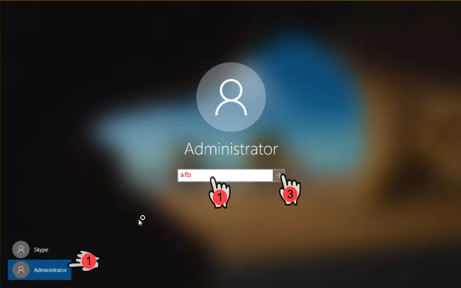

***We now need to enable Remote Desktop follow the steps below.***
***Right click on Windows Logo, select System.***
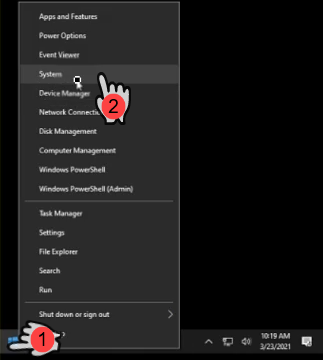

***In the Settings, scroll down until you see Remote Desktop***
***Now in the right windows you’ll see Enable Remote Desktop tap on it.***
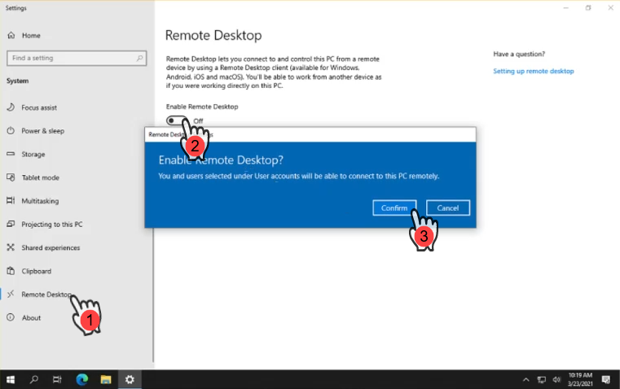

***Underneath***
***You’ll see “How to connect to this PC”***
***Use this PC name to connect from your remote device:***
***Double click on the name to highlight it then right click to then copy.***
***Provide me that PC Name.***

***_That’s it, you’ll all done._***
